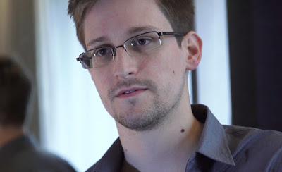

_Do governments care about your privacy anyway_

Whistleblower Edward Snowden is a man who works for welfare of people. He disclosed numerous global surveillance programs, many run by the NSA and the Five Eyes Intelligence Alliance with the cooperation of telecommunication companies and European governments.

Things that he disclosed have fueled debates over mass surveillance, government secrecy, and the balance between national security and information privacy.

Now Snowden has said that the Government of India should impose penalty on anyone who uses Aadhar data for non-public purposes.

He said that privacy of Indians has time and again been compromised by Unique Identification Authority of India (UIDAI) Aadhar scheme.

## Aadhar creates mass surveillance system for society

Snowden was addressing a gathering on theme ‘Being a whistleblower’ and ‘Talk Journalism’ through a video conference in Jaipur, India. He was live from an undisclosed location and when he came online, there was just white background.

He shared concerns about Aadhar monitoring programmes, UIDAI, whistleblower laws, safety of journalists and his return to the US.

He said,

> In India, if the Aadhaar system has to work then there should be criminal penalty on agencies for disclosing personal details. In India, the condition is like you can’t have a baby if you don’t have Aadhaar.

His point of view is very important because he believes that no government will decide your rights but rather introduce a new program under the pretext of public welfare and national security.

## Government needs to give an account of why you do not need rights

Taking a dig at UIDAI and Indian Government, Snowden said, “Government needs to explain why you don’t need rights”. This is in favor of citizens who are concerned about their privacy.

## Preserving Privacy does not take great efforts

In concern with people who violate privacy stems, Snowden believes that preserving privacy is not very difficult and only takes two things to work out. The first one is to have better encryption systems and second is to have a strong legal system to deal with privacy issues.

According to me, it’s the responsibility of government to protect your data and safeguard you against privacy threats

## Snowden’s words to journalists

According to the whistleblower, journalists can oppose surveillance activities as they are “equipped with truth which cannot be changed.” He also added that journalists must seek truth that they bring to people.

Previously he also added on a journalist’s investigation on Aadhar breach that the Government should award him instead of investigating him.

## Conclusion

As no system is ever secure, Snowden’s words on Aadhar database and it leaks are valid. And the best positive thing the Government of India can do is to make it more secure and not share Aadhar information with third parties who can use it for any purpose.

Even after so many hardships after leaving NSA and the US, he is comfortable and proudly says,

> I used to work for the government. Now I work for the public.

Snowden also said that he is concerned of ‘world turning in Chinese market’ than his own government.

If you are concerned about Aadhar you can learn more about what UIDAI has to say in their FAQ [here](https://uidai.gov.in/images/recently_asked_ques_13012018.pdf).
